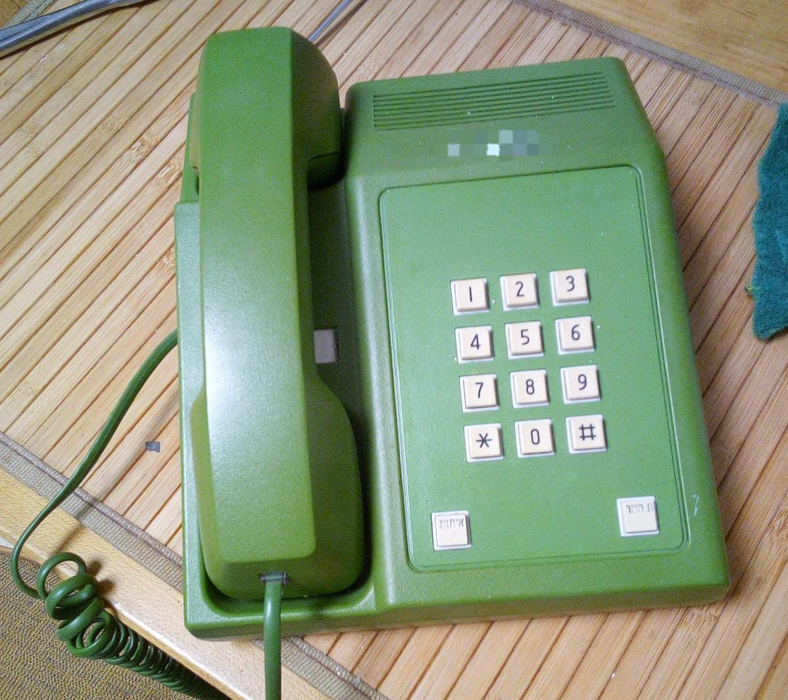

# bezeqtech

Landline phone turned macro pad

* Keyboard Maintainer: [jeremingo](https://github.com/jeremingo)
* Hardware Supported: Arduino Pro Micro
* Hardware Availability: [Aliexpress](https://aliexpress.com/wholesale?SearchText=arduino+pro+micro)

Make example for this keyboard (after setting up your build environment):

    make jeremingo/bezeqtech:default

Flashing example for this keyboard:

    make jeremingo/bezeqtech:default:flash

See the [build environment setup](https://docs.qmk.fm/#/getting_started_build_tools) and the [make instructions](https://docs.qmk.fm/#/getting_started_make_guide) for more information. Brand new to QMK? Start with our [Complete Newbs Guide](https://docs.qmk.fm/#/newbs).

## Bootloader

Enter the bootloader in 3 ways:

* **Bootmagic reset**: Hold down the key at (0,1) in the matrix (usually the top left key or Escape) and plug in the keyboard
* **Physical reset button**: Briefly press the button on the back of the PCB - some may have pads you must short instead
* **Keycode in layout**: Press the key mapped to `QK_BOOT` if it is available
